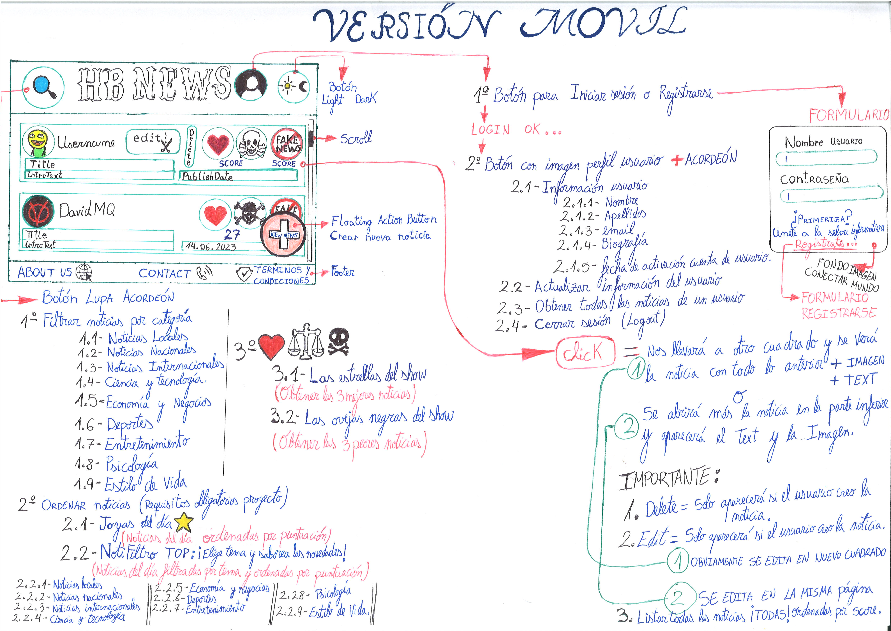

# **HB News** - Plataforma de Noticias Colaborativas

HB News es una plataforma web de noticias colaborativas que permite a los usuarios registrados compartir y explorar noticias sobre una variedad de temas.
Siguiendo el estilo de sitios populares como Reddit o Menéame, los usuarios pueden registrarse, publicar noticias y participar en la clasificación de puntuación de las mismas.

## **Diseño de boceto básico:**



## **Diseño de boceto de las funcionalidades de nuestra página web**


# Características Principales

## Usuarios Anónimos

- Visualización de noticias:
  Pueden explorar la lista de las últimas noticias del día, ordenadas por valoración.

- Filtrado:
  Se ofrece la posibilidad de filtrar las noticias por tema, permitiendo a los usuarios encontrar contenido relevante a sus intereses.

- Login:
  Los usuarios anónimos pueden registrarse y iniciar sesión en la plataforma para acceder a características adicionales.

## Usuarios Registrados

Los usuarios registrados tienen acceso a todas las funcionalidades disponibles para los usuarios anónimos, además de las siguientes opciones:

- Publicación de noticias:
  Los usuarios registrados pueden crear y publicar sus propias noticias en la plataforma. Para ello, deben proporcionar los siguientes detalles:

  1. Título de la noticia.
  2. Foto (opcional).
  3. Título introductorio.
  4. Texto completo de la noticia.
  5. Tema de la noticia.

- Edición y eliminación de noticias:
  Los usuarios pueden editar o eliminar las noticias que hayan publicado previamente, brindándoles control sobre su contenido.

- Votación de noticias:
  Los usuarios registrados pueden votar positiva o negativamente las noticias de otros usuarios.
  Esto permite destacar las noticias más populares y relevantes, así como filtrar contenido menos valorado.

- Gestión del perfil de usuario:
  Los usuarios pueden gestionar su perfil personal, incluyendo la edición de su nombre, apellidos, correo electrónico, biografía y foto de perfil. Esto les permite personalizar su presencia en la plataforma.

## Tecnologías Utilizadas

HB News ha sido desarrollada utilizando las siguientes tecnologías:

- Lenguaje de Programación: JavaScript
- Framework Frontend: React
- Enrutamiento: React Router
- Estilización: CSS
- Base de Datos: MySQL
- Backend: Node.js con Express

## Requisitos de Instalación

Para instalar y ejecutar la plataforma HB News en tu entorno local, sigue estos pasos:

1. Clona el repositorio de HB News desde GitHub:

   - **URL del repositorio BACKEND:** https://github.com/DMQuiroga/BACKEND

   - **URL del repositorio FRONTEND:** https://github.com/DMQuiroga/FRONTEND

1. Instala las dependencias necesarias utilizando npm i
1. Crea archivo .env y completalo con tus datos siguiendo como ejemplo el .exampleenv
1. Leer archivo README tanto en BACKEND como en FRONTEND

## Contribución

Si deseas contribuir al desarrollo de HB News, sigue estos pasos:

- Haz un clone del repositorio HB News desde GitHub.
- Crea una rama para tu nueva funcionalidad o corrección de errores:
  git checkout -b nombre-rama.
- Realiza los cambios necesarios y realiza commits claros.
  ```
  - git status
  - git add .
  - git commit -m "Explicación de tu mejora o correción"
  - git push origin nombre-rama
  - Sube tus cambios a tu rama.
  - Creame una solicitud de pull request a main.
  ```

## Equipo

- David Martínez Quiroga
- Eduardo Castro Bianchi
- Guillermo de la Rosa
- Fran Valderrey

## Agradecimientos

Queremos expresar nuestro profundo agradecimiento a Hack a Boss, la escuela donde tuvimos la oportunidad de estudiar y aprender habilidades fundamentales en el desarrollo de software. Agradezco especialmente al equipo de profesores y a nuestra orientadora profesional por su dedicación y apoyo durante todo el _Bootcamp JSB18RT_.

Quiero reconocer el valioso conocimiento compartido por cada uno de los profesores, cuya experiencia y pasión por la enseñanza han sido fundamentales en nuestro crecimiento como desarrolladores.

Además, quiero agradecer a todo el equipo que forma la empresa Hack a Boss por su visión, compromiso y entorno de aprendizaje colaborativo.
Estamos agradecidos por la oportunidad de formar parte de esta comunidad y por la confianza que han depositado en nostros como estudiantes.

Gracias a Hack a Boss, hemos adquirido las habilidades y la confianza necesarias para emprender nuevos desafíos en el mundo del desarrollo de software.
Estamos emocionados por seguir creciendo y aplicar todo lo aprendido en futuros proyectos.
